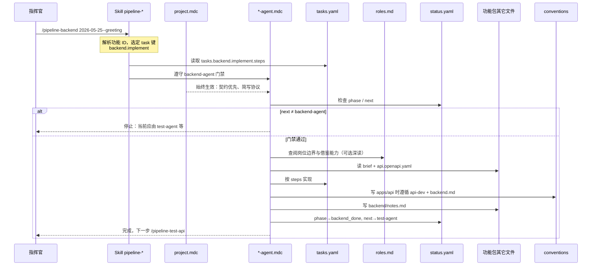
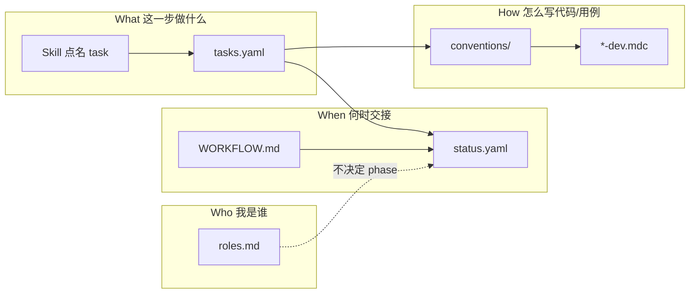
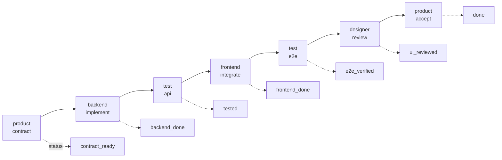
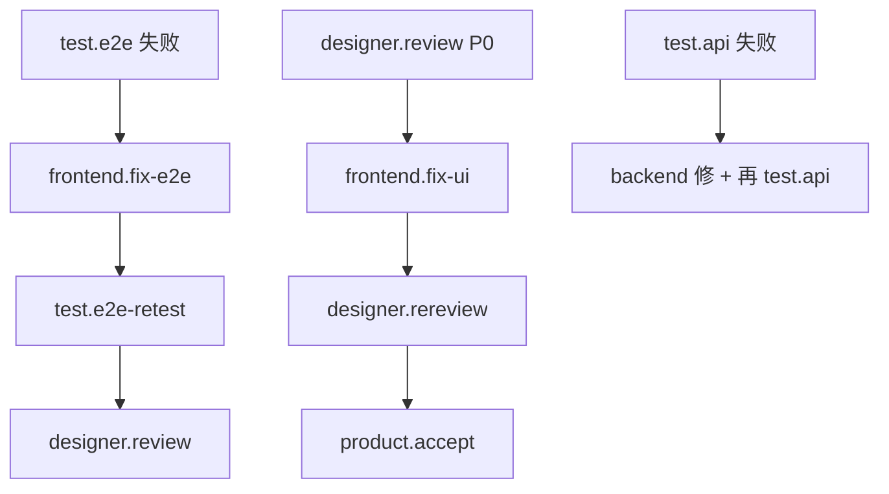

# 唤起 Agent 时发生了什么

> 你从指挥官视角喊一句：`/pipeline-backend 2026-05-25--greeting` 或 `@backend-agent.mdc 2026-05-25--greeting`。  
> **总览图（单独保存）**：[overview-diagram.md](overview-diagram.md) · 源文件：[diagrams/invoke-overview.mmd](diagrams/invoke-overview.mmd)

---

## 总览（一张图）

与 [overview-diagram.md](overview-diagram.md) 同源；下文为详细展开（时序、返工、主路径）。

---

## 按时间顺序（推荐理解路径）

---

## 四类「说明文档」分工（别混）

| 你唤起时… | 实际在用什么 |
|-----------|----------------|
| `/pipeline-backend 2026-05-25--xxx` | **Skill** 选任务 → **tasks.yaml** 展开步骤 → **backend-agent.mdc** 守门 |
| `@backend-agent.mdc 2026-05-25--xxx` | 无 Skill，**project.mdc** 简写协议 + **agent 规则** 猜/读 **tasks** |
| `/pipeline-next 2026-05-25--xxx` | **Skill** 读 **status.yaml** → **next_task_map** → 自动选 **tasks** |
| Agent 想「像 PM/QA 那样思考」 | 读 **roles.md**（不替代 **status** 门禁） |
| Agent 改 `apps/api/` | 附加 **api-dev.mdc** + **conventions/backend.md** |

---

## 标准主路径（7 步 ↔ 7 次唤起）

每一步都是：**新 Chat → 对应 Skill + 功能 ID → 读 status 门禁 → 执行 tasks 里该步 → 更新 status**。

---

## 返工时的分支（同一套机制）

---

## 指挥官最小记忆

1. **你只给**：功能 ID +（推荐）一个 **Skill** 名。  
2. **门禁看**：`status.yaml` 的 `phase` / `next`。  
3. **步骤在**：`tasks.yaml`（Skill 帮你点名）。  
4. **岗位感在**：`roles.md`（Agent 按边界做事，不越权）。  
5. **代码规范在**：`conventions/` + `*-dev.mdc`（改代码时自动带上）。

操作手册：[COMMANDER.md](COMMANDER.md)
