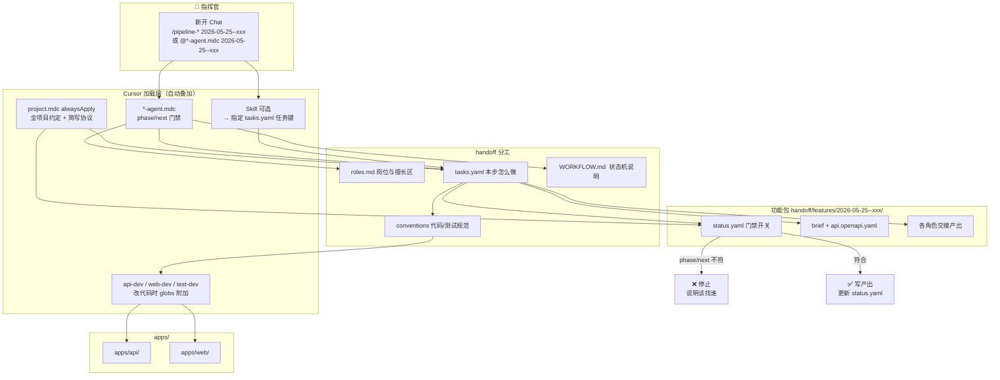

# 唤起 Agent — 总览图

> 你从指挥官视角唤起某 Agent 做 XXX 时，**Rules / Skills / roles / 流转** 如何叠加。  
> 详细时序与返工分支见 [invoke-flow.md](invoke-flow.md)。  
> Mermaid 源文件（便于导出/编辑）：[diagrams/invoke-overview.mmd](diagrams/invoke-overview.mmd)

---

## 总览

---

## 图例（读图用）

| 区域 | 含义 |
|------|------|
| 指挥官 | 你只给 功能 ID + Skill 或 @规则 |
| Cursor 加载层 | 自动叠加上下文；Skill 只有用 `/` 唤起时才有 |
| handoff 分工 | 谁 / 何时 / 做什么 / 怎么写 —— 各管一块 |
| 功能包 | **真相源**：门禁与交接文件都在这里 |
| apps | 实际代码；规范由 conventions + *-dev 约束 |

| 箭头含义 | |
|----------|--|
| Skill / agent → tasks | 展开「做 XXX」的具体步骤 |
| agent → roles | 岗位边界与擅长区（不替代门禁） |
| tasks → status | 执行前/后都要对上门禁 |
| status 不符 → 停止 | 不擅自改 phase，报告该找哪个 Agent |

---

## 相关文档

- [COMMANDER.md](COMMANDER.md) — 你怎么下命令
- [roles.md](roles.md) — 各 Agent 岗位对照
- [tasks.yaml](tasks.yaml) — 任务步骤正文
- [WORKFLOW.md](../WORKFLOW.md) — phase 定义
